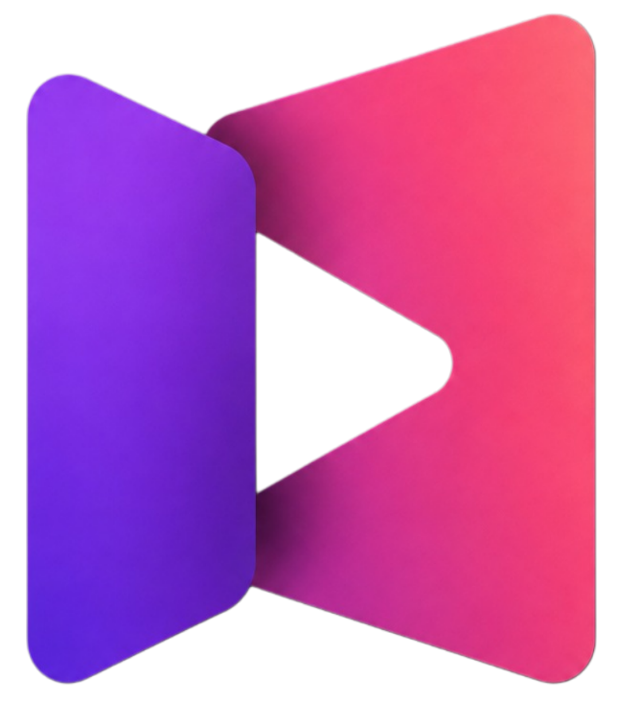
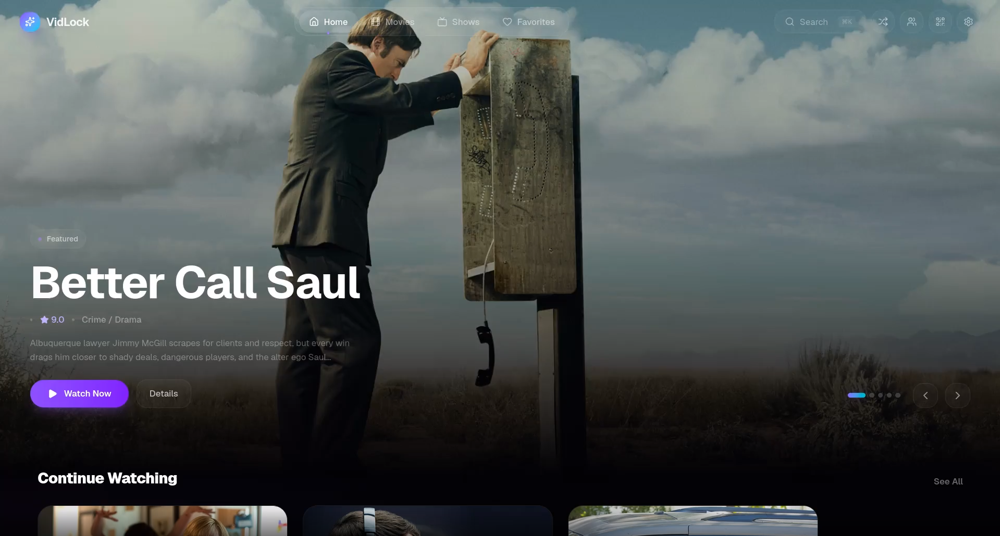
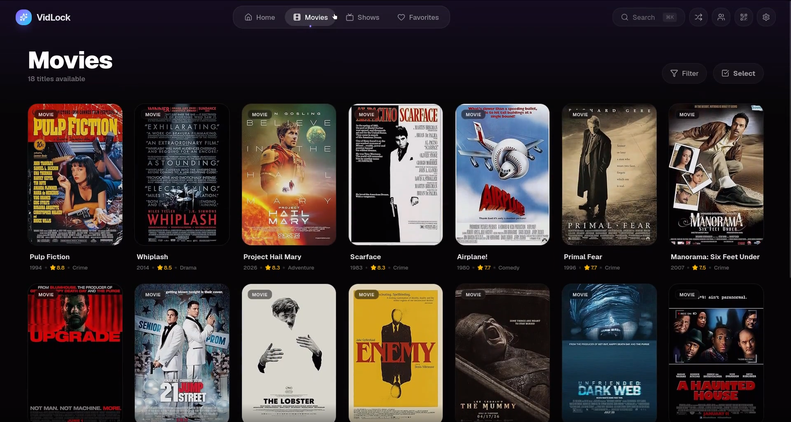
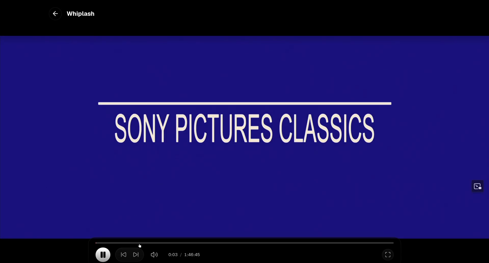
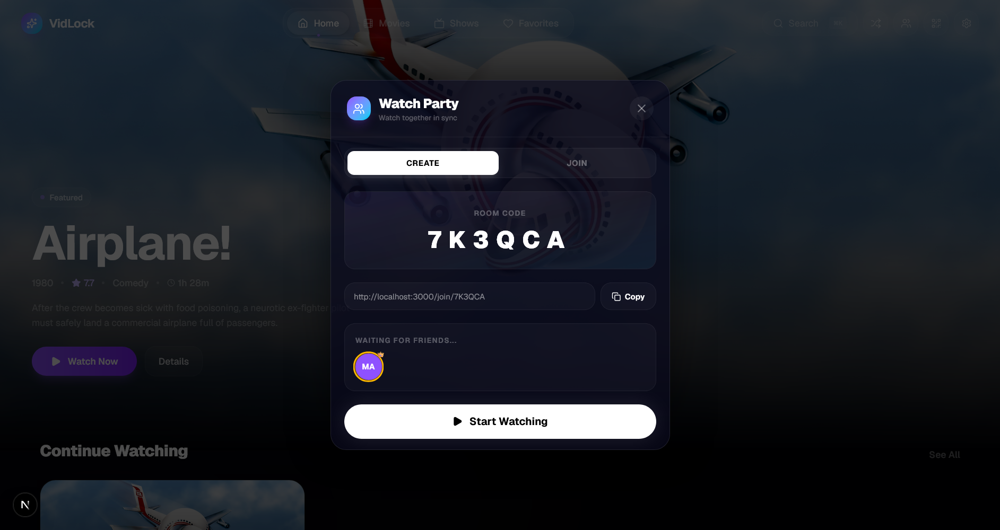

<p align="center">
  
</p>

<h1 align="center">VidLock</h1>

<p align="center">
  <em>No cloud. No accounts. No subscriptions. Just your media, beautifully presented.</em>
</p>

<p align="center">
  
  
  
  
  
  
  
</p>

<p align="center">
  <strong>Zero configuration &middot; Instant premium UI &middot; Hardware transcoding &middot; LAN watch parties</strong><br>
  <sub>A self-hosted, fully local, Netflix-style media server that runs entirely out-of-the-box on a single Node.js process. Everything you need is bundled inside.</sub>
</p>

<p align="center">
  <a href="#-features">Features</a> &middot; 
  <a href="#-quick-start">Quick Start</a> &middot; 
  <a href="#-watch-party">Watch Party</a> &middot; 
  <a href="#-tech-stack">Tech Stack</a>
</p>

<p align="center">
  
</p>

<p align="center">
  <video src="assets/demo.mp4" width="100%" autoplay loop muted playsinline></video>
</p>

---

## ✨ Why VidLock?

VidLock is designed for people who want a premium, Netflix-like experience for their local video files **without the headache of complex server setups**. 

Point VidLock at a folder of movies and TV shows, hit **Scan**, and you instantly get a beautiful browsing UI with hardware-accelerated streaming, subtitles, watch progress tracking, favorites, and synchronized **LAN watch parties**.

Everything runs from a single Node.js process. **No external databases to install, no FFmpeg paths to configure — it works completely out of the box.**

---

## 🚀 Features

<table>
  <tr>
    <td width="50%">
      <h3>📚 Zero-Config Library</h3>
      <p>A smart scanner walks your local folders and external HDDs, automatically parsing filenames (e.g. <i>Show.S01E01.mkv</i>) into structured metadata. It auto-fetches high-quality posters, backdrops, ratings, and plot summaries via OMDB.</p>
    </td>
    <td width="50%">
      <!-- Place your library screenshot in the assets folder as library.png -->
      
    </td>
  </tr>
  <tr>
    <td width="50%">
      <!-- Place your player screenshot in the assets folder as player.png -->
      
    </td>
    <td width="50%">
      <h3>▶️ Cinematic Player</h3>
      <p>A custom HTML5 + HLS.js player with a premium UI. Supports on-the-fly hardware transcoding for unsupported formats (.mkv, .avi, 10-bit HEVC), multi-audio track switching, and embedded/external subtitles.</p>
    </td>
  </tr>
  <tr>
    <td width="50%">
      <h3>🎉 LAN Watch Parties</h3>
      <p>Host synchronized movie nights on your local network. Share a 6-character room code (or a QR code). The server handles frame-accurate NTP-style clock synchronization so everyone pauses, plays, and seeks at the exact same millisecond.</p>
    </td>
    <td width="50%">
      <!-- Place your watch party screenshot in the assets folder as watch-party.png -->
      
    </td>
  </tr>
</table>

### 💎 More Highlights
- **Hardware Acceleration:** Auto-detects and utilizes NVENC (Nvidia), AMF (AMD), VAAPI (Linux), or QSV (Intel) for silky-smooth transcoding.
- **TV Mode:** Auto-redirects LG webOS and smart TV browsers to a lightweight `/tv` UI designed specifically for remote controls.
- **Offline Resilience:** If you unplug an external HDD, its movies are gracefully marked "offline" instead of being deleted from your library.
- **Admin PIN:** Lock down your settings and metadata edits with a secure PIN.

---

## ⚡ Quick Start

Thanks to bundled binaries, getting VidLock running is incredibly simple on Windows, Mac, or Linux.

```bash
# 1. Clone the repo
git clone https://github.com/Manish6523/local-media-server.git
cd local-media-server

# 2. Install dependencies (SQLite & FFmpeg are auto-installed!)
npm install

# 3. Start the application
npm run dev
```

That's it! Open **http://localhost:3000** in your browser. 

<details>
<summary><strong>⚙️ Initial Configuration (First Run)</strong></summary>

1. Go to **Settings** in the VidLock UI.
2. Provide your **OMDB API Key** *(Get a free one at [omdbapi.com](https://www.omdbapi.com/apikey.aspx))*.
3. Set your **Local Media Folder** path (where your movies/shows are stored).
4. Click **Save** and then **Scan Library**.
</details>

---

## 🛠️ Tech Stack

VidLock is built with modern, bleeding-edge web technologies:

- **Frontend:** Next.js 15 (App Router), React 19, Tailwind CSS v4, Framer Motion
- **Backend:** Custom Node.js HTTP server + WebSockets (Socket.IO)
- **Database:** SQLite (WAL mode) via `better-sqlite3` + Drizzle ORM
- **Media Engine:** Bundled FFmpeg + ffprobe (transcoding/probing), HLS.js (playback)

---

## 🐛 Troubleshooting

| Issue | Solution |
|---|---|
| **Scan finds 0 files** | Ensure your media folder path is correct in Settings. Ensure files follow standard naming (e.g., `Movie (Year).mp4` or `Show S01E01.mkv`). |
| **Posters not showing in Prod** | Make sure you run `npm start` instead of `next start`. VidLock uses a custom server to serve dynamic images. |
| **Watch party out of sync** | Have the guest refresh their browser to recompute the network clock offset. |

---

## 📖 Documentation & Architecture

For a deep-dive into the architecture, API routes, database schema, Socket.IO event matrix, and extension guides, please see [DOCUMENTATION.md](./DOCUMENTATION.md).

---

<div align="center">
  <p>Built with ❤️ for local media hoarders.</p>
  <p>License: MIT</p>
</div>
