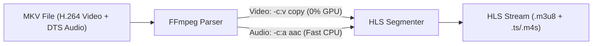
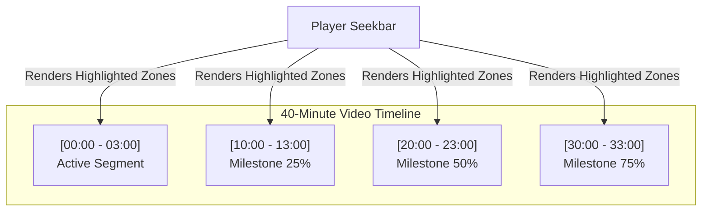
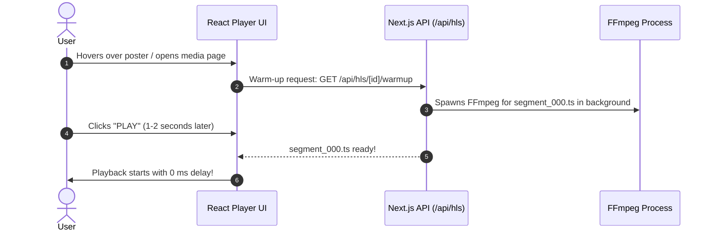

# HLS Architecture & Modern Streaming Features

This document provides a detailed breakdown of modern HLS (HTTP Live Streaming) optimization techniques, architectural patterns, and trade-off analyses for **VidLock (`local-media-server`)**.

---

## 1. Core Concepts & Architectural Features

### Feature A: Video Remuxing / Stream Passthrough (`-c:v copy`)

#### The Problem
When playing container formats like `.mkv` or `.avi` with H.264 video streams, traditional video servers re-encode the entire video stream frame-by-frame on the GPU or CPU. This wastes GPU cycles and causes 2–5 second startup buffers.

#### The Passthrough Solution
Instead of re-encoding video pixels, FFmpeg copies the existing H.264 video stream untouched (`-c:v copy`) and only transcodes incompatible audio tracks (e.g., DTS, AC3 $\rightarrow$ AAC).



#### Key Benefits
* **Near-0% GPU / CPU Usage**: Stream copying is a pure disk-to-disk packet wrap.
* **Instant Start (< 100ms)**: Zero encoding latency.
* **100% Original Quality**: No lossy re-compression artifacts.

---

### Feature B: Fragmented MP4 (fMP4 / CMAF) vs MPEG-2 TS (`.ts`)

#### Comparison Table

| Feature | Legacy `.ts` (MPEG-2 Transport Stream) | Modern `fMP4` (`.m4s` / Fragmented MP4) |
|---|---|---|
| **Origin Year** | 1995 (Broadcast TV standard) | 2016 (ISO Media Standard) |
| **Packet Overhead** | High (188-byte packets + repeated headers) | Minimal (ISO BMFF box structure) |
| **Bandwidth Efficiency** | Baseline | **5–10% smaller segment size** |
| **Codec Compatibility** | H.264 only on web browsers | **H.264, HEVC (4K 10-bit), AV1, VP9** |
| **Apple / Smart TV** | Re-encoding required for HEVC | **Native HEVC hardware pass-through** |

---

## 2. Timeline Chunk Pre-Transcoding & Seekbar Visualizer

### Concept Overview

Instead of transcoding sequentially from start to finish, the server dynamically generates **milestone chunks** across the movie timeline while playing. Pre-transcoded zones are exposed via API and rendered as **visual buffer indicators** directly on the video player's seekbar.



### How the Player & Server Interact

1. **Player UI**: The custom seekbar fetches active cached ranges from `GET /api/hls/[id]/chunks` and highlights available ranges in **blue/green overlay bars**.
2. **Instant Seeking**: If a user clicks on a highlighted range, playback starts with **0 ms latency**.
3. **On-Demand Fallback**: If a user clicks an un-highlighted range, the server shifts the active transcode worker to that new position immediately.

---

## 3. Analysis: What Happens If We Skip the 2-Minute Pre-Transcode?

You asked: *What happens if we do NOT pre-transcode the first 2 minutes in advance?*

### Impact Comparison

```
Option A: With 2-Min Pre-Transcode
[User Clicks Video] -------------------------> [Play Starts Instantly (0 ms)]
                     (Pre-transcoded in bg)

Option B: Without 2-Min Pre-Transcode (Pure On-Demand)
[User Clicks Video] ---> [FFmpeg Boot (1-3s)] ---> [Segment 0 Ready] ---> [Play Starts]
```

### Trade-off Breakdown

#### 1. Startup Delay (Non-Passthrough Files)
* **With 2-min Pre-transcode**: `0 ms` start latency.
* **Without 2-min Pre-transcode**: `1 to 3 seconds` initial buffering delay on GPU (or `3–6s` on CPU) while FFmpeg initializes and generates `segment_000.ts`.

#### 2. Passthrough Files (`-c:v copy`)
* **Effect**: **Zero noticeable difference!** Because video stream copying takes `< 100 ms` to produce segment 0, pre-transcoding the first 2 minutes is unnecessary for Passthrough-compatible files.

#### 3. System Resources & Disk Space
* **With 2-min Pre-transcode**: Eats ~50–150 MB storage per media item; triggers background disk/GPU activity even if the user never watches the video.
* **Without 2-min Pre-transcode**: **0 MB disk space used** before clicking play, **0 background CPU/GPU load** while browsing the library.

---

## 4. Recommended Optimal Hybrid Approach: "Hover Warm-up"

Instead of pre-transcoding files in the background when added to the library, use **Hover / Route Warm-up**:



### Why Hover Warm-up Wins:
1. **0 Storage Wasted**: Nothing is pre-stored on disk before user interaction.
2. **0 Background Load**: Hardware encoders remain 100% idle while browsing.
3. **Instant Start**: By the time the user clicks Play or the page transition finishes, `segment_000.ts` is already pre-generated in memory/cache!
